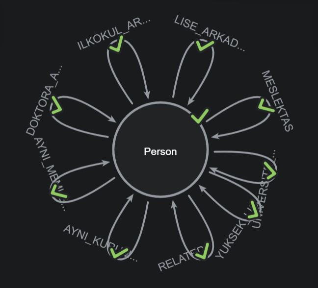

📌 LLM Biyografi Analizi Projesi
Bu proje, Yapay Zeka (LLM) kullanarak biyografi belgelerinden özet bilgiler çıkarmayı ve kişiler arasındaki ortak özelliklere dayalı ilişkileri belirlemeyi amaçlar.

🚀 Neler Yapabilir?

✅ Ortak Özelliklere Göre Bağlantı Kurma:
Doğum yeri, eğitim geçmişi, çalışma hayatı ve yaşadığı şehir gibi veriler üzerinden kişiler arasındaki bağlantıları oluşturur.
Eğitim ve iş geçmişinde tarih kesişmelerini kontrol ederek gerçekten aynı dönemde bulunup bulunmadıklarını belirler.

✅ Otomatik İlişki Haritaları:
Aynı okulda okuyan, aynı kurumda çalışan veya aynı şehirde yaşayan kişiler arasındaki ilişkileri otomatik görselleştirir.

✅ Kolay Veri İşleme:
Markdown biyografi dosyalarını işler, JSON formatında yapılandırılmış veri üretir ve bu verileri grafik tabanlı ilişki haritalarına dönüştürür.

📊 Örnek Kullanım Alanları
📌 Aynı okulda aynı dönemde okuyan kişileri bulma
📌 Aynı şirkette aynı dönemde çalışan kişileri tespit etme
📌 Aynı memleketten olan insanları listeleme
📌 Aynı şehirde yaşayan insanları keşfetme 

Örneğin:
{
  "source": "Zehra Ermiş",
  "target": "Zeynep Uzun",
  "relations": [
    "AYNI_MEMLEKETTEN",
    "LISE_ARKADASI",
    "UNIVERSITE_ARKADASI",
    "MESLEKTAS",
    "AYNI_KURUMDA_CALISMIS"
  ]
}

  
